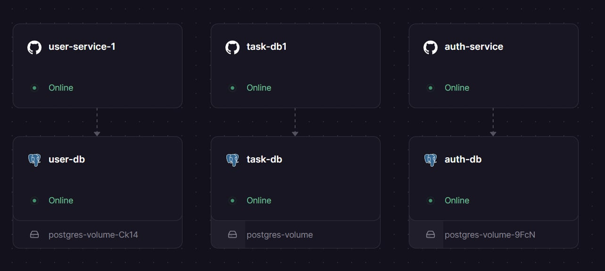
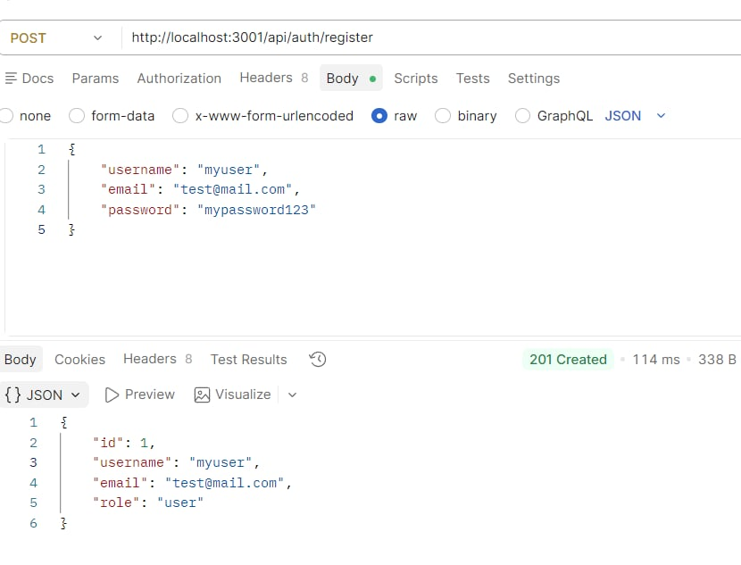
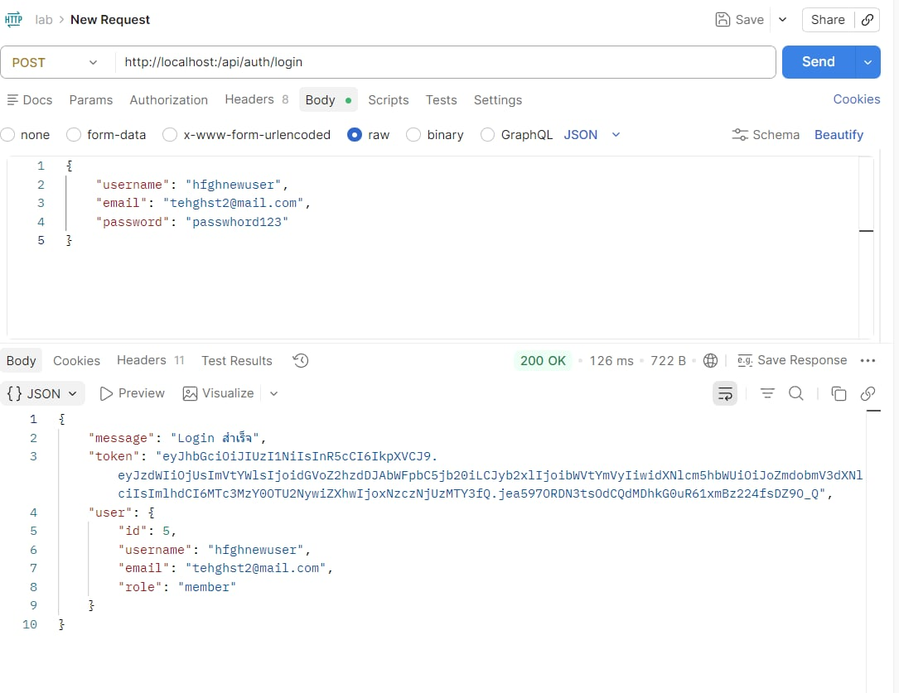
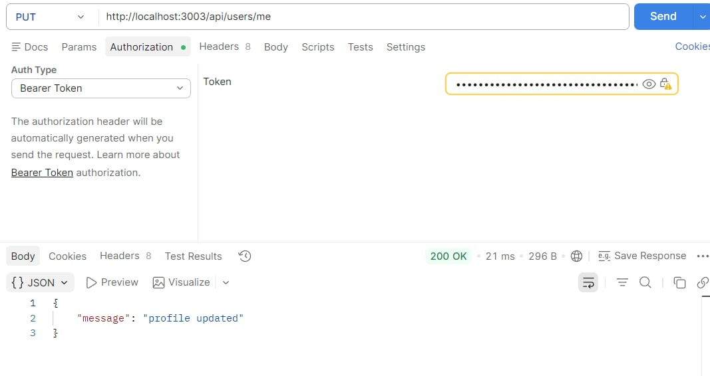
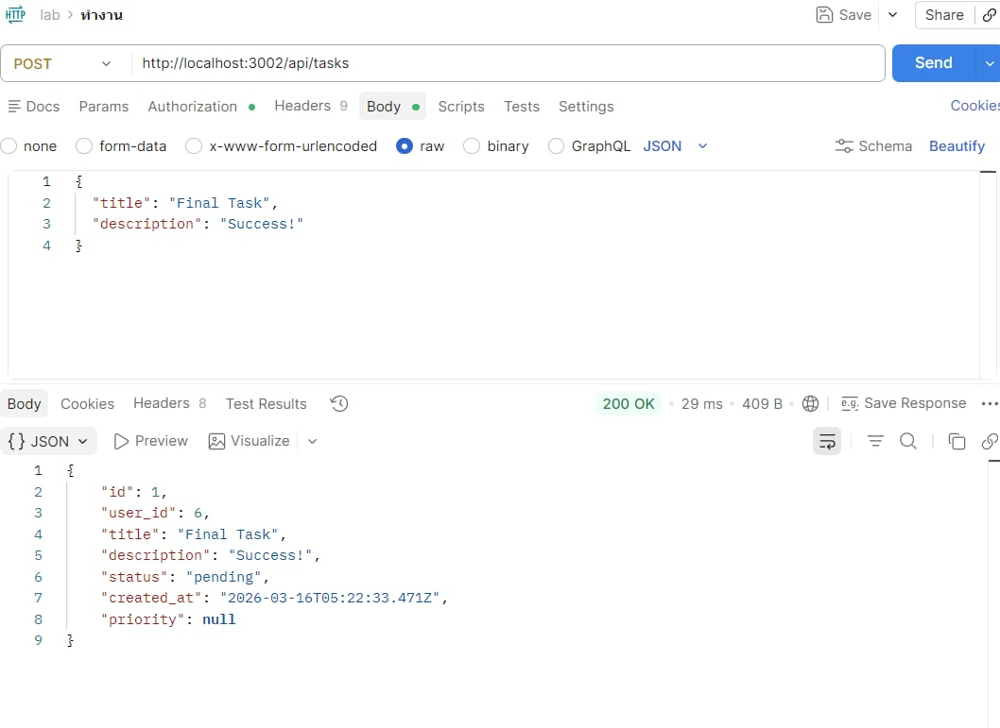

# ENGSE207 Software Architecture

## README — Final Lab Set 2: Microservices + Database per Service + Cloud Deployment

> เอกสารฉบับนี้ใช้เป็น `README.md` สำหรับ repository ของ **Final Lab Set 1**  
> นักศึกษาสามารถปรับแก้รายละเอียด เช่น ชื่อสมาชิก, ภาพ architecture, URL หรือคำอธิบายเพิ่มเติม ให้สอดคล้องกับงานจริงของกลุ่ม

---

## 1. ข้อมูลรายวิชาและสมาชิก

**รายวิชา:** ENGSE207 Software Architecture  
**ชื่องาน:** Final Lab — ชุดที่ 2: Microservices + Database per Service + Cloud Deployment

**สมาชิกในกลุ่ม**

- ชื่อ-สกุล / รหัสนักศึกษา: นายวีราวัชร์ สุประดิษฐ์พงศ์ 67543210045-0
- ชื่อ-สกุล / รหัสนักศึกษา: นายชยานันท์ เพชรรักษ์ 67543210016-1

**Repository:** `final-lab-set1/`

---

## 2. ภาพรวมของระบบ

Final Lab ชุดที่ 2 เป็นการพัฒนาระบบ Task Board Microservices ต่อจาก Set 1 โดยเพิ่มความสามารถดังนี้

- เพิ่ม User Service
- เพิ่ม Register API
- เปลี่ยนจาก Shared Database → Database per Service
- Deploy ระบบขึ้น Railway Cloud Platform
  ระบบยังคงใช้
- JWT Authentication
- REST API communication
- Docker Containerization
  แต่ละ service มี database ของตัวเองเพื่อลด coupling ของระบบ

---

## 3. วัตถุประสงค์ของงาน

- งานนี้มีจุดมุ่งหมายเพื่อฝึกให้นักศึกษาสามารถ
- ออกแบบระบบแบบ Microservices Architecture
- แยก Database ต่อ Service
- ออกแบบ Authentication ด้วย JWT
- สร้างระบบ User Management
- Deploy Microservices บน Cloud Platform
- ออกแบบระบบที่สามารถ scale ได้ในอนาคต

---

## 4. Architecture Overview

> ให้วางภาพ architecture diagram ของกลุ่มไว้ในส่วนนี้

```text
Client (Browser / Postman)
        │
        │ HTTPS
        ▼
 ┌─────────────────┐
 │   Auth Service  │
 │   (Login/Register)
 └────────┬────────┘
          │
        auth-db

 ┌─────────────────┐
 │   User Service  │
 │   (Profile API)
 └────────┬────────┘
          │
        user-db

 ┌─────────────────┐
 │   Task Service  │
 │   (Task CRUD)
 └────────┬────────┘
          │
        task-db
```

### Services ที่ใช้ในระบบ

- **Auth Service** — Register, Login, JWT
- **User Service** — User profile management
- **PostgreSQL** — Database per service
- **Task-service** — Task CRUD

---

## 5. ความแตกต่างจาก Set 1

Feature │ Set 1 │ Set 2 │
Authentication│ Login only │ Register + Login │
Database │ Shared DB │Database per Service │
Services │ auth, task, log │auth, task, user │
Deployment │ Local Docker │ Railway Cloud │
Logging │Lightweight logging│ simplified │

---

## 6. โครงสร้าง Repository

```text
final-lab-set1/
├── README.md
├── TEAM_SPLIT.md
├── INDIVIDUAL_REPORT_[studentid].md
├── docker-compose.yml
├── .env.example
├── auth-service/
├── task-service/
├── user-service/
├── db/
├── scripts/
└── screenshots/
```

---

## 7. เทคโนโลยีที่ใช้

- Node.js
- Express.js
- PostgreSQL
- Docker
- Docker Compose
- JWT Authentication
- bcryptjs
- Railway Cloud Platform
- HTML / CSS / JavaScript

---

## 8. การตั้งค่าและการรันระบบ

### 8.1 Clone Repository

```bash
git clone <repo-url>
cd final-lab-set2
```

### 8.2 สร้างไฟล์ `.env`

คัดลอกจาก `.env.example` แล้วกำหนดค่าตามต้องการ เช่น

```env
JWT_SECRET=engse207-super-secret

AUTH_DB=authdb
TASK_DB=taskdb
USER_DB=userdb
```

### 8.3 รันระบบด้วย

```bash

docker compose down -v
docker compose up --build

```

หลังจากรันสำเร็จ services จะเปิดที่

```bash

Auth Service : http://localhost:3001
Task Service : http://localhost:3002
User Service : http://localhost:3003

```

## 9. Authentication Flow

ระบบใช้ JWT Token สำหรับ authentication
ขั้นตอนการทำงาน
```bash
##1. ผู้ใช้สมัครสมาชิกผ่าน
POST /api/auth/register

## 2. ผู้ใช้ login
POST /api/auth/login

## 3. ระบบจะสร้าง JWT Token
## 4.Client ต้องส่ง Token ใน header
Authorization: Bearer <JWT_TOKEN>

## 5. Services อื่น ๆ จะตรวจสอบ JWT ก่อนอนุญาตให้เข้าถึงข้อมูล
```

---

## 10. API Summary

Auth Service
```bash
#Register
POST /api/auth/register

#Login
POST /api/auth/login

#Get Current User
GET /api/auth/me

```

User Service

```bash
#Get User Profile
GET /api/users/me

#Update Profile
PUT /api/users/me

#Admin List Users
GET /api/users

```

Task Service

```bash
#Create Task
POST /api/tasks

#Get Tasks
GET /api/tasks

#Update Task
PUT /api/tasks/:id

#Delete Task
DELETE /api/tasks/:id
```
---

## 11. Cloud Deployment (Railway)

ระบบถูก Deploy บน Railway Cloud Platform
แต่ละ service ถูก deploy แยกกัน
```
Auth Service
Task Service
User Service
PostgreSQL Databases
```

Environment Variables ที่ใช้

```
DATABASE_URL
JWT_SECRET
```

---
## 12. การทดสอบระบบ

การทดสอบทำผ่าน Postman
ตัวอย่างขั้นตอน

- 1. Register user
- 2. Login user
- 3. เรียก API /auth/me
- 4. เรียก /users/me
- 5. สร้าง task
- 6. ดูรายการ task
- 7. แก้ไข task
- 8. ลบ task
- 9. ทดสอบ API ที่ต้องใช้ JWT
- 10. ทดสอบ admin permissions

---

## 13. Gateway Strategy

ใน Phase 5 ของโปรเจกต์นี้ ทีมได้เลือกใช้ **Option A: Frontend เรียก URL ของแต่ละ service โดยตรง**

### เหตุผลในการเลือก

วิธีนี้เป็นวิธีที่ง่ายที่สุดในการ deploy ระบบในสภาพแวดล้อม Cloud เนื่องจากไม่จำเป็นต้องตั้งค่า API Gateway หรือ Reverse Proxy เพิ่มเติม ทำให้สามารถลดความซับซ้อนของระบบและลดขั้นตอนในการ deploy

Frontend จะทำหน้าที่เรียก API ของแต่ละ service โดยตรงผ่าน URL ที่กำหนดไว้ในไฟล์ configuration

### ตัวอย่างการตั้งค่าใน Frontend

```javascript
window.APP_CONFIG = {
  AUTH_URL: 'https://auth-service-production.up.railway.app',
  TASK_URL: 'https://task-service-production.up.railway.app',
  USER_URL: 'https://user-service-production.up.railway.app'
};

```
---

## 14. Screenshots

ภาพการทดสอบอยู่ในโฟลเดอร์ `screenshots/` ประกอบด้วย

- `01_railway_dashboard.png`

- `02_auth_register_cloud.png`

- `03_auth_login_cloud.png`

- `04_auth_me_cloud.png`

- `05_user_me_cloud.png`

- `06_user_update_cloud.png`

- `07_task_create_cloud.png`

- `08_task_list_cloud.png`

- `09_protected_401_check.png`

- `10_member_forbidden_403.png`

- `11_admin_users_success.png`

- `12_readme_architecture.png`

---

## 15. การแบ่งงานของทีม

รายละเอียดการแบ่งงานอยู่ในไฟล์

- `TEAM_SPLIT.md`

รายงานรายบุคคลอยู่ในไฟล์

- `INDIVIDUAL_REPORT_[studentid].md`

---

## 16. ปัญหาที่พบระหว่างทำงาน

- `ตัวอย่างปัญหาที่พบระหว่างการพัฒนา`
- `JWT secret ไม่ตรงกันระหว่าง services`
- `Database connection ผิดพลาดตอน deploy`
- `Service บางตัว start ก่อน database ทำให้ connection fail`
- `CORS configuration ตอนเรียก API จาก frontend`
- `การ deploy หลาย service บน Railway`

---

## 17. ข้อจำกัดของระบบ

- `ยังไม่มี API Gateway เต็มรูปแบบ`
- `ยังไม่มี centralized logging`
- `ยังไม่มี service discovery`
- `ยังไม่ได้ใช้ container orchestration เช่น Kubernetes`
- `ระบบนี้เป็น ตัวอย่าง Microservices สำหรับการเรียนรู้ระดับพื้นฐาน`

---

## 18. สรุป

### Final Lab Set 2 แสดงให้เห็นการพัฒนาระบบจาก`
```bash
Shared Database Architecture
```

### ไปสู่
```bash
Microservices + Database per Service
```

### ซึ่งช่วยให้
- `ลด coupling ของระบบ`
- `เพิ่มความสามารถในการ scale`
- `แยก responsibility ของ service ชัดเจน`

ระบบนี้สามารถต่อยอดไปสู่ Production Microservices Architecture ได้ในอนาคต
